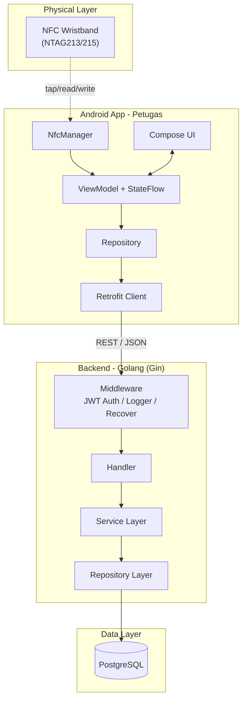
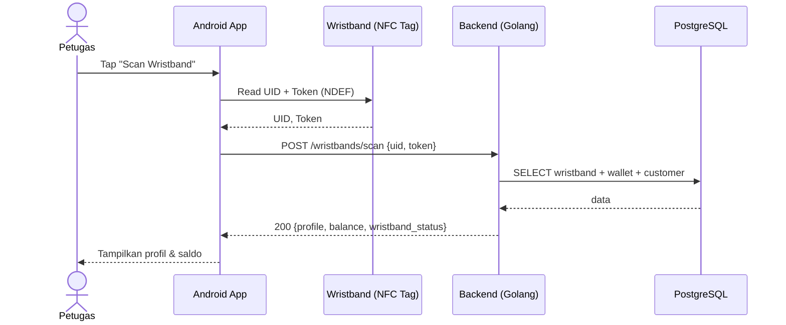
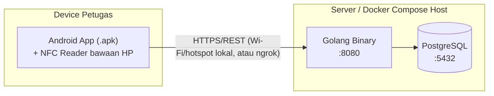
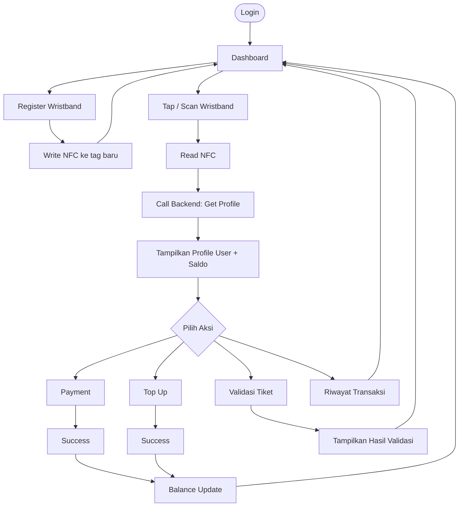
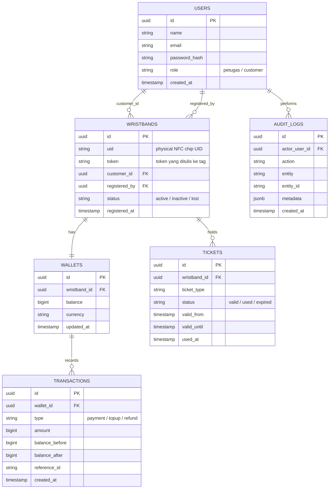
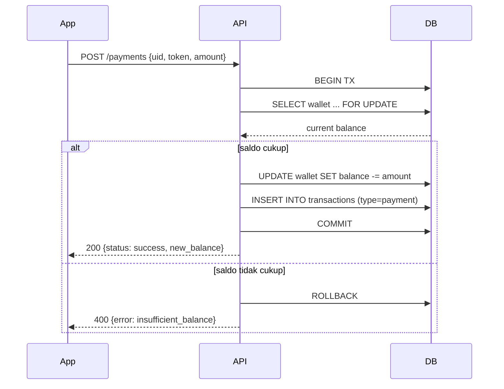
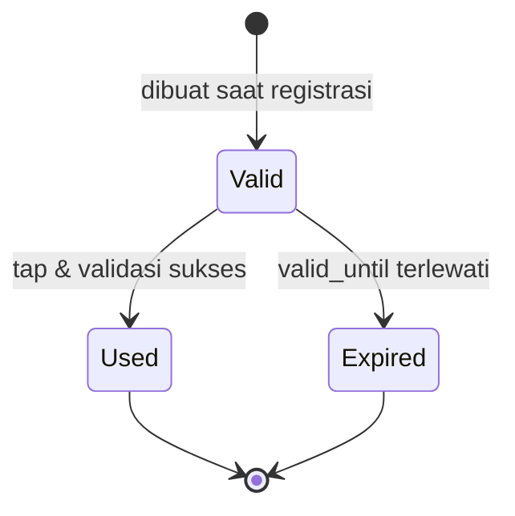

# NFC Wristband PoC — System Design & Architecture

**Role:** Senior Software Architect / Android / Golang
**Konteks:** Solo developer, target = demo yang terlihat profesional, bukan production-ready.

---

## 0. Analisis Kebutuhan & Prinsip Desain

Sebelum masuk ke desain, beberapa asumsi & prinsip yang saya pakai supaya scope tetap realistis untuk 1 developer:

| Prinsip | Alasan |
|---|---|
| Monolith, bukan microservices | 1 backend Go, 1 database. Tidak ada kebutuhan scaling independen untuk demo. |
| Synchronous REST, tanpa queue | Payment & ticket validation adalah operasi cepat (< 1 detik), tidak butuh async processing. |
| Tanpa Redis/cache | Data demo kecil (puluhan–ratusan wristband). Query Postgres langsung sudah cukup cepat. |
| Tanpa CQRS/Event Sourcing | Menambah kompleksitas tanpa nilai tambah untuk demo. Cukup CRUD + service layer. |
| 2-layer Android (data + presentation) | Skip layer "domain/usecase" formal. ViewModel boleh panggil Repository langsung. Lebih cepat dibangun, tetap gampang di-refactor kalau proyek berlanjut. |
| Docker Compose, bukan Kubernetes | Deployment demo cukup 1 container Go + 1 container Postgres di 1 host/laptop. |

Fokus dikunci ke **happy path + 7 skenario error paling penting** (lihat bagian 11), bukan menutupi semua edge case produksi.

---

## 1. High-Level Architecture



**Alasan desain:**
- **Monolithic Go backend** — satu binary, satu deployment unit. Cukup untuk beban demo, dan jauh lebih mudah di-debug oleh 1 orang dibanding beberapa service.
- **JWT stateless auth** — tidak perlu session store (Redis), backend jadi stateless dan gampang di-restart tanpa kehilangan sesi login petugas.
- **NFC logic di Android, bukan di backend** — backend hanya menerima UID/token hasil baca; semua urusan protokol NFC (NDEF, tag detection) murni di sisi Android.

### Sequence Diagram — Alur Umum (Tap → Lihat Profil)



### Deployment Diagram



Untuk demo: cukup jalankan `docker-compose up` (Go + Postgres) di laptop presenter, HP Android terhubung ke Wi-Fi/hotspot yang sama. Kalau perlu diakses dari luar jaringan, tinggal expose lewat ngrok — tidak perlu setup cloud server.

### Data Flow (ringkas)
1. Android baca UID/token dari tag → kirim ke backend.
2. Backend cocokkan ke tabel `wristbands`, ambil `wallets`/`tickets` terkait.
3. Aksi (payment/topup/validate) mengubah data di Postgres dalam 1 DB transaction.
4. Response dikirim balik → Android update UI (StateFlow) secara reaktif.

---

## 2. User Flow



---

## 3. Android Architecture

**Pendekatan:** MVVM + Repository, **2 layer** (data + presentation). Layer `domain/usecase` formal sengaja di-skip untuk demo — kalau nanti proyek berkembang, ekstraksi ke UseCase tinggal refactor kecil dari kode Repository/ViewModel yang sudah rapi.

```
app/
├── di/                        # Hilt module (network, database, repository)
├── data/
│   ├── remote/
│   │   ├── api/                # Retrofit service interfaces
│   │   └── dto/                # Request/Response model (bukan domain model)
│   ├── repository/             # Implementasi repository (single source of truth)
│   └── nfc/                    # NfcManager: wrap NdefFormatable, tag read/write
├── ui/
│   ├── auth/
│   ├── dashboard/
│   ├── scan/
│   ├── profile/
│   ├── wallet/
│   ├── payment/
│   ├── ticket/
│   ├── history/
│   ├── registerwristband/
│   └── components/             # Composable shared (Button, Card, LoadingState, dsb.)
├── navigation/                 # NavHost + NavGraph (Navigation-Compose)
├── util/                       # Result wrapper, Extension functions
└── MainActivity.kt
```

**Detail keputusan:**
- **State management:** setiap screen punya `UiState` (sealed class: `Loading / Success / Error`) yang di-expose via `StateFlow` dari ViewModel, di-collect dengan `collectAsStateWithLifecycle()` di Compose.
- **Navigation:** single-activity, `Navigation-Compose`, tidak perlu multi-module.
- **DI:** **Hilt** direkomendasikan (standar Google, auto-generated, cocok untuk dev berpengalaman). Alternatif: **Koin** kalau mengejar kecepatan setup tanpa boilerplate annotation — trade-off-nya Koin resolve dependency di runtime (error baru ketahuan saat run, bukan compile time).
- **NFC:** gunakan `NfcAdapter` + `ReaderMode` (bukan Foreground Dispatch) — lebih simpel untuk kontrol kapan reader aktif/nonaktif (mis. hanya aktif saat di screen Scan/Register).

---

## 4. Backend Architecture (Golang)

```
nfc-wristband-backend/
├── cmd/
│   └── api/
│       └── main.go            # entrypoint: load config, wiring dependency, start server
├── internal/
│   ├── config/                 # baca .env → struct Config
│   ├── model/                  # struct GORM: User, Wristband, Wallet, Transaction, Ticket, AuditLog
│   ├── dto/                    # request/response struct, decouple dari model DB
│   ├── handler/                # Gin handler: parsing request, panggil service, format response
│   ├── service/                # business logic (cek saldo, generate token, state tiket)
│   ├── repository/             # akses DB (GORM query) per entity
│   ├── middleware/              # JWTAuth, Logger, Recovery, CORS
│   └── router/                  # setup route Gin, grouping per resource
├── migrations/                  # SQL migration (golang-migrate)
├── pkg/
│   └── utils/                   # hash password, generate token, response wrapper (success/error format seragam)
├── go.mod
└── docker-compose.yml           # Postgres untuk local dev
```

**Alasan per folder:**
- **`dto` terpisah dari `model`** — supaya struktur database tidak "bocor" langsung ke API contract (mis. `password_hash` tidak pernah ke-expose di response), dan supaya perubahan skema DB tidak otomatis mem-break kontrak API.
- **`service` sebagai struct biasa, bukan interface + mock** — untuk demo, testing unit yang ekstensif bukan prioritas. Kalau nanti butuh unit test service, tinggal extract interface saat itu terjadi (YAGNI).
- **`repository`** tetap dipisah dari `service` walau tidak pakai interface — supaya query GORM tidak bercampur dengan business logic, memudahkan kalau nanti pindah/tambah data source.
- **Tidak ada folder `usecase` terpisah** — logic bisnis cukup di `service`, karena kompleksitasnya masih rendah (validasi saldo, cek expiry tiket, dsb).

---

## 5. Database Design

### ERD



**Catatan desain penting:**
- **`users` menampung 2 role**: `petugas` (login ke app, punya password) dan `customer` (pemilik wristband, tidak login). Sengaja digabung 1 tabel dengan kolom `role` untuk demo — daripada bikin `staff_users` + `customers` terpisah, ini lebih sederhana dan cukup untuk skala demo. Kalau kebutuhan role membesar, tinggal split belakangan.
- **`wallet_transactions` yang diminta di brief digabung menjadi satu `transactions`** dengan kolom `type` (payment/topup/refund) — daripada punya `transactions` dan `wallet_transactions` terpisah yang datanya tumpang tindih. Ini mengurangi duplikasi tanpa kehilangan informasi (semua field ledger: balance_before/after tetap ada).
- **`audit_logs`** mencatat aksi level admin/petugas (login, register wristband, write NFC) — terpisah dari `transactions` yang murni mencatat pergerakan saldo.

---

## 6. NFC Design

| Opsi | Keterangan | Cocok untuk demo? |
|---|---|---|
| **UID saja** | UID chip (mis. MIFARE/NTAG serial number) bersifat *read-only*, dibaca otomatis tanpa perlu "write" | Simpel & anti-tamper, tapi tidak memenuhi requirement "Write NFC" di brief |
| **UUID yang ditulis ke tag** | Generate UUID di backend saat registrasi, tulis ke NDEF record tag | Memenuhi requirement write, tapi UUID panjang & tidak ada nilai tambah dibanding UID |
| **Random Token yang ditulis ke tag** | Backend generate token pendek (mis. 16 karakter random), ditulis ke NDEF, disimpan juga di DB | ✅ **Direkomendasikan** |

**Rekomendasi: kombinasi UID + Token (defense in layer, bukan defense in depth penuh)**
- **UID** dipakai sebagai identifier utama saat registrasi (disimpan di kolom `wristbands.uid`) — karena UID tidak bisa ditulis ulang di kebanyakan tag konsumer, ini natural primary key fisik.
- **Token random** ditulis ke NDEF record tag saat proses **Write NFC** (memenuhi requirement demo "Write NFC" secara nyata, bukan sekadar baca UID).
- Saat **Scan**, backend validasi **UID *dan* token cocok** dengan record di DB → kalau tag di-clone (UID sama tapi token beda karena tag lain), validasi tetap gagal.
- Gunakan tag **NTAG213/215** (NDEF, writable, murah, kompatibel luas dengan Android) — hindari MIFARE Classic yang butuh key auth tambahan dan tidak semua HP support baca-nya secara native.

Untuk production sungguhan, ini masih bisa di-spoof (UID cloning secara hardware tetap mungkin) — tapi untuk demo, kombinasi ini sudah cukup meyakinkan dan menunjukkan proses "write" secara nyata di depan audiens.

---

## 7. REST API

| Method | Endpoint | Deskripsi | Auth |
|---|---|---|---|
| POST | `/api/v1/auth/login` | Login petugas | ❌ |
| GET | `/api/v1/profile/me` | Profil petugas yang login | ✅ |
| POST | `/api/v1/wristbands/register` | Daftarkan wristband baru → buat customer + wallet | ✅ |
| POST | `/api/v1/wristbands/write` | Generate token & tandai tag sudah ditulis (dipanggil setelah Android sukses tulis NDEF) | ✅ |
| POST | `/api/v1/wristbands/scan` | Baca wristband → ambil profil + saldo + status tiket | ✅ |
| POST | `/api/v1/payments` | Proses pembayaran, potong saldo | ✅ |
| POST | `/api/v1/wallet/topup` | Top up saldo wristband | ✅ |
| GET | `/api/v1/wallet/:wristbandId` | Cek saldo wallet | ✅ |
| GET | `/api/v1/transactions?wristband_id=` | Riwayat transaksi | ✅ |
| POST | `/api/v1/tickets/validate` | Validasi tiket via wristband | ✅ |
| GET | `/api/v1/tickets/:wristbandId` | Info tiket wristband | ✅ |

### Contoh Request/Response

**POST /api/v1/auth/login**
```json
// Request
{ "email": "petugas1@demo.com", "password": "secret123" }

// Response 200
{
  "token": "eyJhbGciOiJIUzI1NiIs...",
  "user": { "id": "uuid", "name": "Petugas 1", "role": "petugas" }
}
```

**POST /api/v1/wristbands/scan**
```json
// Request
{ "uid": "04A2B3C1", "token": "TKN-8F2Q1X" }

// Response 200
{
  "wristband_status": "active",
  "customer": { "id": "uuid", "name": "Budi Santoso" },
  "wallet": { "balance": 150000, "currency": "IDR" },
  "ticket": { "status": "valid", "valid_until": "2026-07-13T23:59:00Z" }
}
```

**POST /api/v1/payments**
```json
// Request
{ "uid": "04A2B3C1", "token": "TKN-8F2Q1X", "amount": 25000, "reference_id": "ORD-001" }

// Response 200
{ "status": "success", "new_balance": 125000, "transaction_id": "uuid" }

// Response 400 (saldo kurang)
{ "status": "failed", "error": "insufficient_balance", "current_balance": 15000 }
```

**POST /api/v1/tickets/validate**
```json
// Request
{ "uid": "04A2B3C1", "token": "TKN-8F2Q1X" }

// Response 200
{ "result": "valid", "ticket_type": "1-day-pass", "used_at": "2026-07-13T09:00:00Z" }

// Response 409
{ "result": "already_used", "used_at": "2026-07-13T08:15:00Z" }
```

---

## 8. Payment Flow



**Kenapa desain ini cukup untuk demo:**
- 1 DB transaction (`BEGIN...COMMIT`) dengan `SELECT ... FOR UPDATE` sudah cukup mencegah race condition dasar (dua tap beruntun ke wristband yang sama) tanpa perlu locking terdistribusi/Redis.
- Tidak perlu idempotency key untuk demo (skenario retry ganda jarang terjadi di depan audiens), tapi kolom `reference_id` sudah disediakan sebagai fondasi kalau mau ditambahkan nanti.

---

## 9. Ticket Validation



Alur: **Tap → Backend cek status tiket → Valid** (tandai `used`, catat `used_at`) **/ Used** (tolak, tampilkan waktu pemakaian sebelumnya) **/ Expired** (tolak, tampilkan tanggal expired) **→ Display Result** di Android dengan warna berbeda (hijau/kuning/merah).

---

## 10. UI Demo (Material Design 3)

| Screen | Komponen Utama |
|---|---|
| **Login** | `OutlinedTextField` (email/password), `FilledButton` |
| **Dashboard** | Grid shortcut (Scan, Register, Wallet, History) pakai `Card` + icon |
| **Scan NFC** | Full-screen animasi "tap your wristband" + `CircularProgressIndicator` saat membaca |
| **User Profile** | `Card` besar: nama, foto placeholder, status wristband, saldo |
| **Wallet** | Saldo besar di atas, `FilledButton` Top Up, list riwayat singkat di bawah |
| **Payment** | Input nominal / pilih item, `Card` konfirmasi, tombol bayar |
| **Ticket** | `Card` status warna-kode (hijau=valid, abu=used, merah=expired) |
| **Transaction History** | `LazyColumn` list dengan filter tanggal/tipe |
| **Register Wristband** | Form data customer + tombol "Tap to Write NFC" |

Gunakan `NavigationBar` (bottom nav) untuk 4 menu utama (Dashboard, Wallet, History, Profile), `Snackbar` untuk error, `TopAppBar` konsisten di setiap screen.

---

## 11. Error Handling

| Skenario | Kapan terjadi | Respons UX |
|---|---|---|
| Wristband belum terdaftar | Scan UID yang tidak ada di DB | Dialog: "Wristband belum terdaftar" + tombol ke Register |
| Saldo tidak cukup | Payment amount > balance | Dialog merah, tampilkan saldo saat ini |
| Tiket sudah digunakan / expired | Validate ticket status ≠ valid | Card merah/kuning + waktu pemakaian/expired |
| API gagal (5xx) | Server error | Snackbar generic + tombol retry |
| Tidak ada internet | No connectivity | Banner offline persisten, nonaktifkan aksi yang butuh backend |
| NFC tidak aktif | NFC disabled di setting HP | Dialog + tombol shortcut ke Settings NFC |
| Wristband tidak terbaca | Tag rusak/terlalu cepat diangkat | Timeout 5 detik → "Coba lagi, dekatkan wristband" |

---

## 12. MVP Features

**Wajib (harus ada untuk demo terlihat lengkap):**
- Login petugas
- Register wristband (generate token + write NFC)
- Scan wristband → tampilkan profil & saldo
- Payment (potong saldo)
- Top up saldo
- Riwayat transaksi
- Validasi tiket (valid/used/expired)
- 7 skenario error di atas

**Nice to Have:**
- Audit log viewer (UI khusus admin)
- Role-based admin panel terpisah dari petugas
- Offline caching (Room) untuk histori
- Biometric login
- Dark mode
- Animasi transisi antar screen
- Refund flow
- Export riwayat transaksi (PDF/CSV)

---

## 13. Roadmap Implementasi

| Tahap | Fokus | Output |
|---|---|---|
| 1 | Setup project — repo, `docker-compose` (Postgres), skeleton Go & Android project | Project bisa di-run kosongan |
| 2 | Backend: Auth + User (JWT login, seed data petugas) | `/auth/login`, `/profile/me` jalan |
| 3 | Backend: Wristband CRUD + Wallet init otomatis saat register | `/wristbands/register`, `/wristbands/write` |
| 4 | Backend: Payment + Transaction (DB transaction, cek saldo) | `/payments`, `/wallet/topup`, `/wallet/:id` |
| 5 | Backend: Ticket Validation + Audit Log | `/tickets/validate`, log tercatat |
| 6 | Android: Login + Navigation shell + Dashboard | Bisa login, navigasi antar screen kosong |
| 7 | Android: NFC Read/Write + Register Wristband screen | Bisa tulis & baca tag fisik |
| 8 | Android: Payment + Wallet + Transaction History | Alur bayar & top up end-to-end |
| 9 | Android: Ticket Validation UI + polish Material3 | Semua screen jadi, UI rapi |
| 10 | Integration testing end-to-end + rehearsal skenario error | Siap demo |

Karena solo developer, tahap dikerjakan berurutan (backend dulu per fitur, baru Android-nya) supaya tiap tahap Android punya API yang sudah siap dites — mengurangi context-switching bolak-balik.

---

## 14. Risiko & Mitigasi

| Risiko | Mitigasi |
|---|---|
| Kompatibilitas NFC berbeda antar HP | Tes lebih awal dengan HP & tag yang akan dipakai saat demo, bukan mendekati hari-H |
| Tag NDEF gagal ditulis (tag terkunci/proteksi) | Pakai tag NTAG213/215 fresh, hindari MIFARE Classic |
| Waktu development mepet (solo dev) | Ikuti roadmap berurutan, MVP dulu baru nice-to-have, sisakan buffer di tahap 10 |
| Race condition saldo saat demo live | Sudah dimitigasi dengan `SELECT ... FOR UPDATE` dalam 1 DB transaction |
| Koneksi jaringan tidak stabil saat demo | Siapkan hotspot lokal (HP + laptop di jaringan sama), backend jalan lokal, tidak bergantung internet luar |

### Deliverables Recap
Semua deliverable yang diminta sudah tercakup: High-Level Architecture (§1), Component & Sequence Diagram (§1), Deployment Diagram (§1), ERD & Schema (§5), REST API Spec (§7), Android Folder Structure (§3), Golang Folder Structure (§4), User Flow (§2), Screen Flow (§10), Roadmap (§13), Risiko & Mitigasi (§14), dan Prioritas pengerjaan (§12–13).
